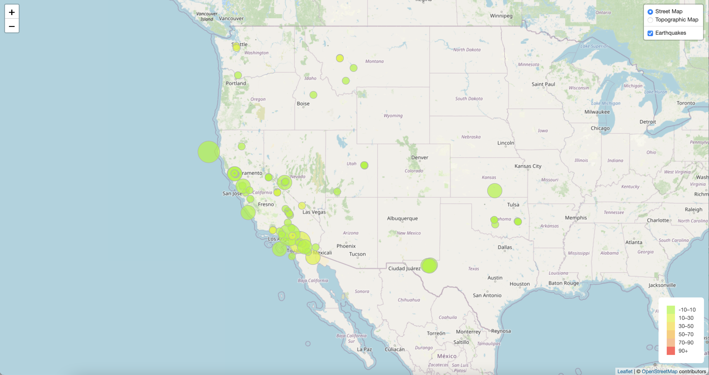
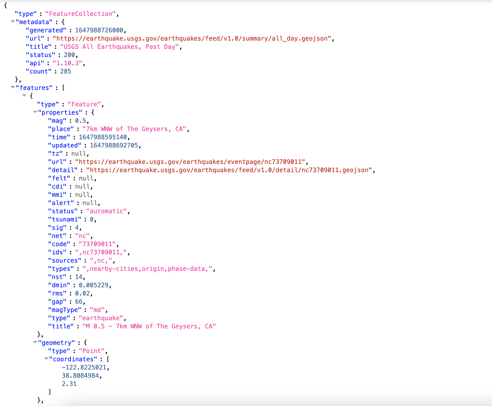

# Web visualization of earthquake data using Leaflet

### Objective

Build a new set of tools to visualize USGS earthquake data.

### Summary

The [United States Geological Survey (USGS)](https://www.usgs.gov) is responsible for providing scientific data about natural hazards, the health of our ecosystems and environment; and the impacts of climate and land-use change. Their scientists develop new methods and tools to supply timely, relevant, and useful information about the Earth and its processes.

The USGS collects a massive amount of data from all over the world each day, but they lack a meaningful way of displaying it. The ability to visualize their data will help them to better educate the public and other government organizations (and hopefully secure more funding) on issues facing our planet.

### Visualization

**The data set guidelines**

The USGS provides earthquake data in a number of different formats, updated every 5 minutes. Visit the [USGS GeoJSON Feed](http://earthquake.usgs.gov/earthquakes/feed/v1.0/geojson.php) page and pick a data set to visualize. When you click on a data set, for example "All Earthquakes from the Past 7 Days", you will be given a JSON representation of that data. You will use the URL of this JSON to pull in the data for our visualization.

**Import and visualize the data**

I created a map using [Leaflet](https://leafletjs.com) that plots all of the earthquakes from the data set based on their longitude and latitude.
   * The data markers reflect the magnitude of the earthquake by their size and and depth of the earthquake by color. Earthquakes with higher magnitudes  appear larger and earthquakes with greater depth appear darker in color.
   * Popups provide additional information about the earthquake when a marker is clicked.
   * A legend provides context for the map data.
   * The final visualization looks something like the map above.
